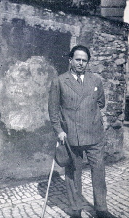

# Reading data

This chapter introduces some basic techniques in reading text corpora using the de facto standard tools in Python.  

 - First explorations with text corpora
 - Using tagging to annotate texts
 - Working with tagged datasets to train machine learning models
 - Basics of Natural Language Processing (NLP)
 - Introduction to Spacy

## Why Kurt Tucholsky ?

 ```{panels}
  - Spanning an interesting time (1890–1935)
  - Historical changes: WWI, rise of Nazis, Kaiser vs. Weimar
  - Character changes: Romantic towards political
  - Geographical changes: Paris, Berlin      
 ---
   
 ```

## Goal

 ```{panels}
  - Capture whole work of Tucholsky
  - With its changes in tone, used language
  - Correlate e.g. keyword development with places, general history
  - Hopefully: Observe trends of Tucholsky's mind
 ---
   
 ```
